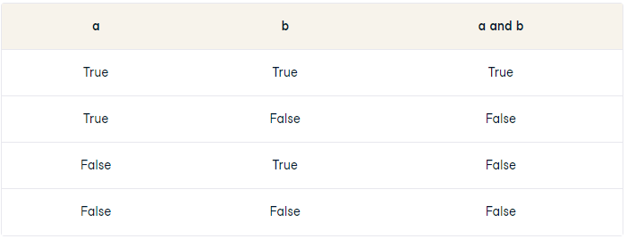
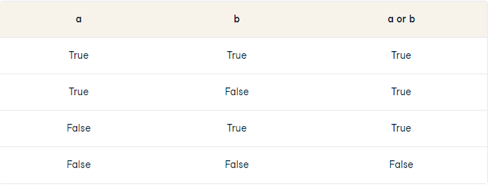

# **Wstęp do programowania Python - 28.10**

We cannot add string with non numeral values to int type. We will get this error:

```bash
TypeError: unsupported operand type(s) for +: 'int' and 'str'
```

We will need to add int method to convert string to integer.

```py
a = 5
b = '10'
print(a + int(b))
```

This method will not work if string consists of non numeral characters.

## **Math Operators**

```py
a = 14
b = 7

# Addition
print(a + b) # return 21

# Subtraction
print(a - b) # return 7

# Multipluication
print(a * b) # return 105

# Division
print(a / b) # return 2.142857142857143

# Modulo
print(a % b) # return 1

# Power
print(2 ** 10) # return 1024
```

Division operation will create float type number from integer. Modulo operation will return regular int.

We can fix this behavoiur with double slash characters.

```py
# Division with double slash
a = 7
b = 15
print(a//15) # return 2
```

Python tends to change data type to float when one of the operands is a floating point number.

## **Shorthand Math Operations**

All common shorthand operations work in python.

```py
a = 17

# Shorthand for a = a + 2
a += 7
print(a) # returns 23

# Shorthand for a = a - 7
a -= 7
print(a) # returns 10

# Shorthand for a = a * 7
a *= 7
print(a) # returns 119

# Shorthand for a = a // 7
a //= 7
print(a) # returns 2
```

## **Comparison**

In Python we can comapare variables with double equality symbol.
We can use common comparison operators.

-   Greater than
-   Greater or equal to
-   Lesser than
-   Lesser or equal to

```py
# Equal to
a = 4
b = 4
print(a == b) #  True

# Not equal to
print(a != b) # False

#   Greater than
print(9 > 3) # True

# Greater or equal to
print(9 >= 9) # True

# Lesser than
print(3 < 5) # True

# Lesser or equal to
perint(5 <= 5) # True
```

## **Is & Is Not Operators**

This operator compares data adresse in the memory. This is like reference type in JavaScript. a is not equal to 9 because a not in the same place in the memory.

If two different variables have the same value than is operator will return true.

```py
a = 9
b = 10
print(a is 3) # False

a = 9
b = 9
print(a is b) # True
print(a is not b) # False
```

## **Logical Operators 'and' & 'or'**

These operators are also widely used in human language. They are: and, or and not.

and will only return True if both operands (the two boolean objects you are comparing) and True. For example:

```py
print(True and True) # True
print(True and False) # False
print(False and False) # False
```

### **and truth table**

To understand this behaviour a little better we can use and truth table.



### **or truth table**

And here is the table for the or logical operator



Order of the operands doesn't matter.

## **String Methods**

We can modify strings by various methods.
We can check length of the string by using len() method.

Variable z is an object and by dot operator we can invoke some methods.

With .copitalize() method we can add the capital letter to the first letter of the string.

With .upper() we can convert the string to uppercase and with .lower() we convert it to lowercase.

```py

# length of string
z = 'cat'
print(len(z)) # 3

# cappitalize
print(z.capitalize()) # Cat

# to upper case
print(z.upper()) # CAT

# to lower case
print(z.lower()) # cat
```

## **Index of an string**

We can select single index of an string just like in the JavaScript.

[0:2] syntax will work just like .slice in JS.

**warning** this method will print only two characters. Second index will nox be taken into considiration. In JS whis would print three characters.

```py
z = 'cat'
print(z[0]) # c

print(z[0:2]) # ca

# Both of these methods will print full string
print(z[0:len(z)]) # cat
print(z[:]) # cat

# Reverse string
print(z[::-1]) #tac
```

By adding next colon we will specify the step which we can jump by when working with strings. By adding -1 we will simply reverse a string.

We can use .split() mothod to modify strings. This methos will return list (array in JS).

```py
z = 'today was nice weather'
print(z.split(' ')) # ['today', 'was', 'nice', 'weather']
```

## **To Do**

-   What is XOR
-   Indexing in Python
-   DisplayLink (optional)
